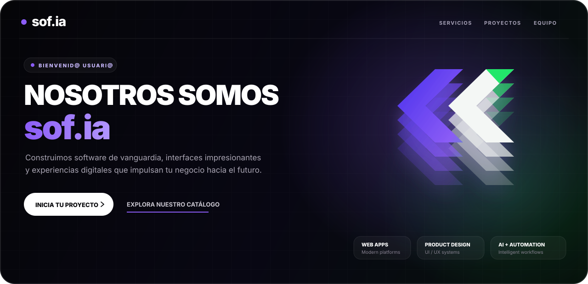
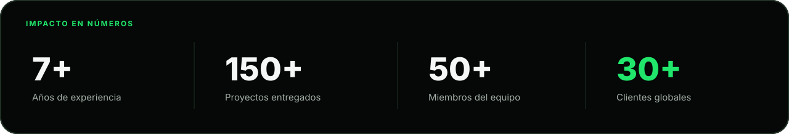
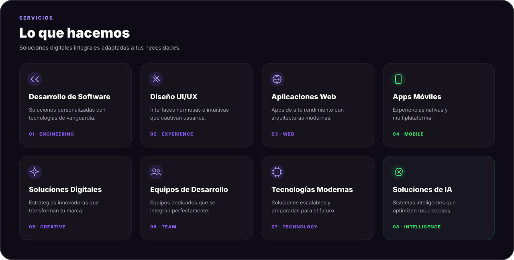
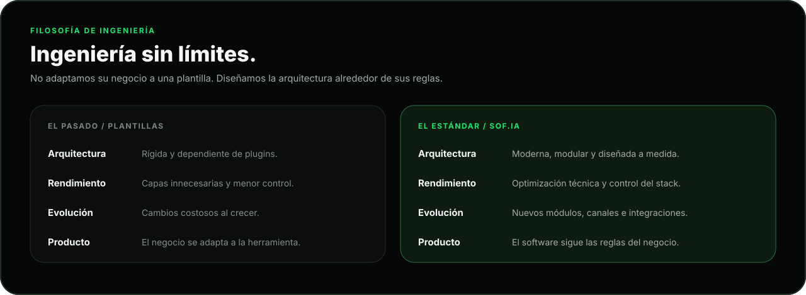
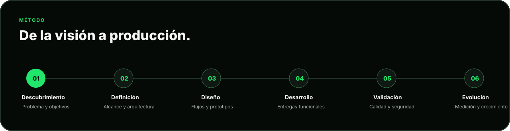
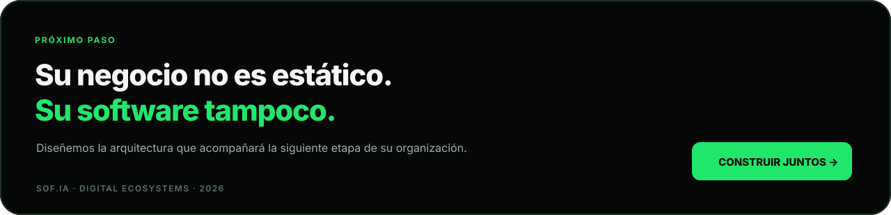

 

 

## Donde la innovación encuentra el diseño

Somos un equipo de creadores, ingenieros y visionarios dedicado a construir experiencias digitales que producen impacto real. Combinamos **ingeniería de software**, **diseño de producto** y **automatización** para transformar ideas, procesos y modelos de negocio en productos preparados para evolucionar.

Desde startups hasta soluciones empresariales, trabajamos como socios tecnológicos: entendemos el problema, definimos una dirección técnica clara y construimos el ecosistema digital que cada organización necesita.

> **No construimos sobre plantillas rígidas ni gestores limitados. Diseñamos arquitecturas robustas alrededor de las reglas de cada negocio.**

 

Las métricas anteriores corresponden a la información institucional publicada por sof.ia.

  

## Lo que hacemos

 

<table>
<tr>
<td width="50%" valign="top">

### Desarrollo de software

Soluciones personalizadas con tecnologías modernas y una base técnica alineada con los objetivos del producto.

- Plataformas SaaS y sistemas corporativos
- Portales empresariales y dashboards
- APIs, integraciones y procesamiento asíncrono
- Gestión documental, logística e inventario
- Sistemas de autenticación, roles y auditoría

</td>
<td width="50%" valign="top">

### Aplicaciones web y móviles

Productos responsivos y conectados, preparados para operar en navegadores, Android e iOS.

- Aplicaciones web de alto rendimiento
- React Native y Flutter
- Persistencia sin conexión y sincronización
- Notificaciones y comunicación en tiempo real
- Publicación, despliegue y evolución continua

</td>
</tr>
<tr>
<td width="50%" valign="top">

### Diseño UI/UX

Experiencias claras y sistemas visuales coherentes que convierten capacidades técnicas en productos utilizables.

- Investigación y arquitectura de información
- Wireframes y prototipos interactivos
- Interfaces responsivas
- Design systems y componentes reutilizables
- Validación de flujos y experiencia

</td>
<td width="50%" valign="top">

### IA, datos y automatización

Flujos inteligentes que conectan información, eliminan trabajo repetitivo y generan capacidad operativa.

- Integración de modelos de inteligencia artificial
- Automatizaciones con n8n
- Pipelines ETL y procesamiento masivo
- Bots para WhatsApp, Telegram y correo
- Analítica, reportes y Business Intelligence

</td>
</tr>
</table>

 

## Nuestra filosofía técnica

 

Nuestro enfoque prioriza:

<table>
<tr>
<td width="33%" valign="top">

### 01 · Arquitectura

Seleccionamos patrones y tecnologías según el contexto. La solución debe ser mantenible, modular y comprensible antes de ser compleja.

</td>
<td width="33%" valign="top">

### 02 · Seguridad

Integramos autenticación, autorización, validación, trazabilidad y protección de datos desde las primeras decisiones del producto.

</td>
<td width="33%" valign="top">

### 03 · Escalabilidad

Preparamos cada sistema para incorporar usuarios, módulos, integraciones y canales sin exigir una reescritura completa.

</td>
</tr>
</table>

---

## Nuestro trabajo

Una selección de productos, interfaces y ecosistemas digitales desarrollados por el equipo.

<table>
<tr>
<td width="50%" valign="top">

### Gnomo Estudio

Plataforma SaaS empresarial con una experiencia de producto enfocada en colaboración, interfaces digitales y análisis en tiempo real.

`React` `Node.js` `Figma` `UX/UI`

</td>
<td width="50%" valign="top">

### Tecno Media

Tienda en línea para productos audiovisuales, construida sobre un sistema visual escalable y una experiencia de catálogo clara.

`React` `Tailwind CSS` `Node.js` `Database`

</td>
</tr>
<tr>
<td width="50%" valign="top">

### NeoArk Capital

Experiencia digital para una plataforma del sector financiero con capacidades multiplataforma, identidad digital y tecnologías Web3.

`React Native` `TypeScript` `Firebase` `Web3`

</td>
<td width="50%" valign="top">

### Plataforma Agromaps

Panel de inteligencia empresarial para el sector agro, con una experiencia web moderna y capacidades apoyadas por inteligencia artificial.

`Next.js` `TypeScript` `TensorFlow` `Data`

</td>
</tr>
<tr>
<td width="50%" valign="top">

### Ecosistema móvil Agromaps

Diseño de experiencia móvil conectado con el ecosistema web de Agromaps y orientado al acceso ágil a información agrícola.

`Figma` `Prototype` `UX Design` `Research`

</td>
<td width="50%" valign="top">

### Diseño de aplicación bancaria

Diseño y prototipado de una experiencia móvil para servicios bancarios, transferencias, remesas y operaciones de usuario.

`Figma` `Prototype` `UI Design` `Research`

</td>
</tr>
</table>

> Algunos productos y repositorios permanecen privados por acuerdos de confidencialidad, protección de datos y propiedad intelectual.

---

## Stack tecnológico

### Frontend

### Backend, datos e infraestructura

### Mobile, diseño y automatización

 

## Cómo trabajamos

 

Cada proyecto se divide en entregas funcionales y verificables. El objetivo no es producir únicamente código, sino reducir riesgo, validar decisiones y mantener una base técnica que pueda evolucionar.

---

## Nuestra esencia

<table>
<tr>
<td width="33%" valign="top">

### Misión

Potenciar empresas mediante tecnología moderna y diseño de alto impacto, creando experiencias digitales que impulsen crecimiento y transformación.

</td>
<td width="33%" valign="top">

### Visión

Ser un referente en innovación digital, construyendo un futuro donde ingeniería y creatividad convergen para resolver desafíos reales.

</td>
<td width="33%" valign="top">

### Valores

**Excelencia · Innovación · Integridad · Colaboración**

Construimos relaciones basadas en confianza, transparencia y calidad técnica.

</td>
</tr>
</table>

 

 

**sof.ia — Creando el futuro digital, un proyecto a la vez.**

[Website](https://sof-ia-landding.vercel.app/) · [Catálogo](https://sof-ia-landding.vercel.app/secondary) · [Proyectos](#nuestro-trabajo)

© 2026 sof.ia. Todos los derechos reservados.

