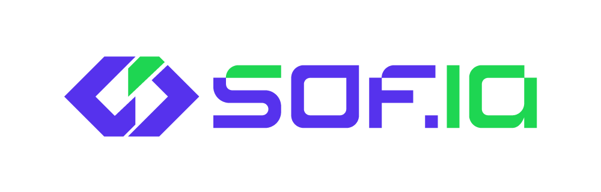
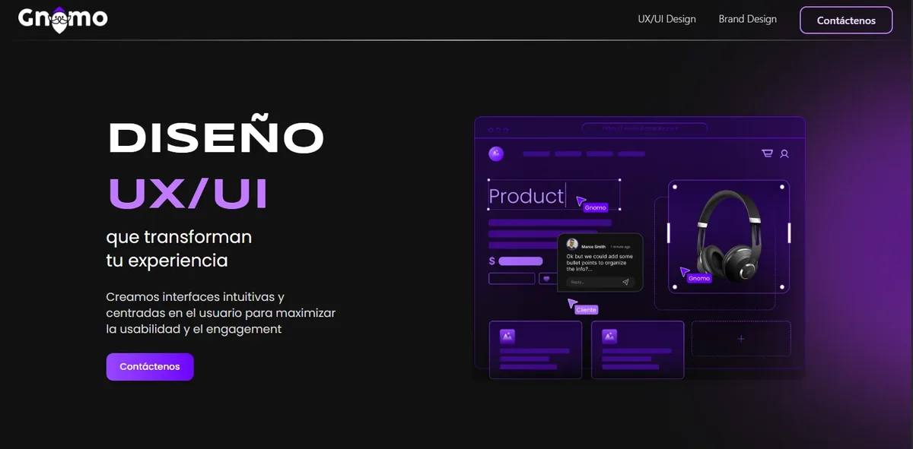
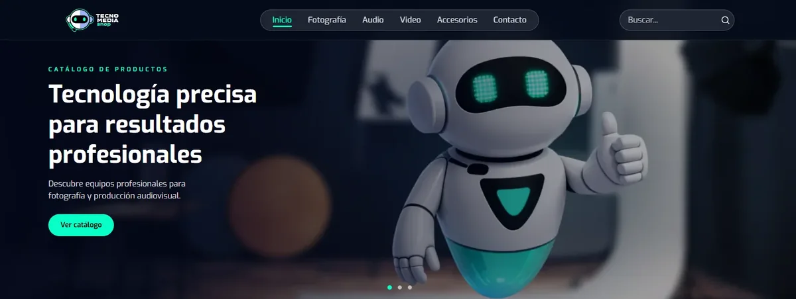
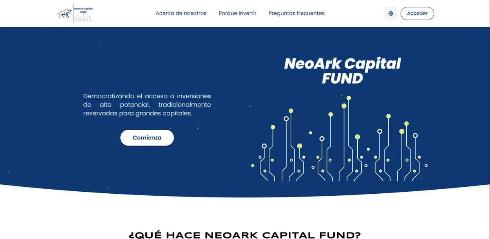
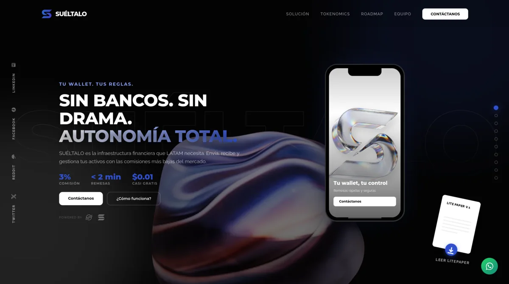
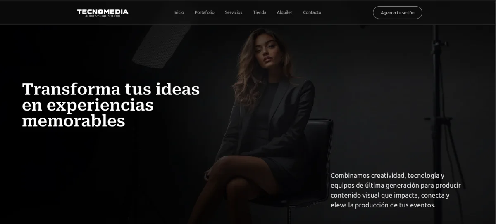
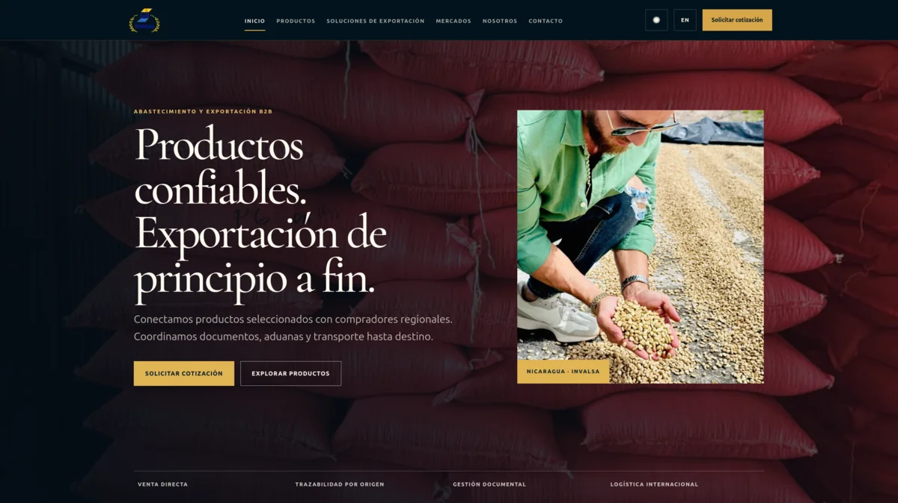
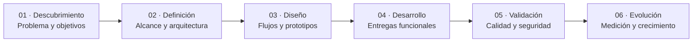

<a href="https://sof-ia-landding.vercel.app/" aria-label="Visitar el sitio web de sof.ia">
  <picture>
    <source media="(prefers-color-scheme: dark)" srcset="./assets/brand/sofia-dark.png">
    <source media="(prefers-color-scheme: light)" srcset="./assets/brand/sofia-light.png">
    
  </picture>
</a>

## Nosotros somos sof.ia

**Construimos software de vanguardia, interfaces memorables y experiencias digitales que impulsan negocios hacia el futuro.**

[Nosotros](#donde-la-innovación-encuentra-el-diseño) · [Servicios](#lo-que-hacemos) · [Proyectos](#proyectos-seleccionados) · [Equipo](#nuestro-equipo) · [Proceso](#cómo-trabajamos) · [Contacto](#construyamos-algo-increíble-juntos)

---

## Donde la innovación encuentra el diseño

Somos un equipo de creadores, ingenieros y visionarios dedicado a diseñar experiencias digitales excepcionales. Combinamos desarrollo de vanguardia, diseño de producto y tecnologías modernas para convertir ideas en productos que generan impacto real.

Desde startups hasta soluciones empresariales, trabajamos como socios tecnológicos para hacer realidad la visión de cada cliente. Cada proyecto es una oportunidad para superar límites y redefinir lo que es posible.

<table>
  <tr>
    <td align="center" width="25%"><h2>7+</h2>AÑOS DE EXPERIENCIA</td>
    <td align="center" width="25%"><h2>150+</h2>PROYECTOS ENTREGADOS</td>
    <td align="center" width="25%"><h2>50+</h2>MIEMBROS DEL EQUIPO</td>
    <td align="center" width="25%"><h2>30+</h2>CLIENTES GLOBALES</td>
  </tr>
</table>

> Creemos en el poder de la tecnología para transformar negocios: arquitectura sólida, diseño con intención y una relación de trabajo transparente.

## Lo que hacemos

Soluciones digitales integrales adaptadas a necesidades, usuarios y procesos reales.

<strong>01 · Producto e ingeniería</strong>

<table>
  <tr>
    <td width="50%" valign="top">
      <h3>Desarrollo de software</h3>
      Soluciones personalizadas con tecnologías de vanguardia, desde el concepto hasta el despliegue.
    </td>
    <td width="50%" valign="top">
      <h3>Aplicaciones web</h3>
      Productos de alto rendimiento con arquitecturas modernas y experiencias fluidas.
    </td>
  </tr>
  <tr>
    <td width="50%" valign="top">
      <h3>Apps móviles</h3>
      Experiencias nativas y multiplataforma para Android e iOS.
    </td>
    <td width="50%" valign="top">
      <h3>Diseño UI/UX</h3>
      Interfaces claras, atractivas e intuitivas que conectan con sus usuarios.
    </td>
  </tr>
</table>

<strong>02 · Innovación y crecimiento</strong>

<table>
  <tr>
    <td width="50%" valign="top">
      <h3>Soluciones digitales creativas</h3>
      Estrategias y experiencias innovadoras que transforman marcas y productos.
    </td>
    <td width="50%" valign="top">
      <h3>Equipos de desarrollo</h3>
      Células dedicadas que se integran de forma natural con cada organización.
    </td>
  </tr>
  <tr>
    <td width="50%" valign="top">
      <h3>Tecnologías modernas</h3>
      Soluciones escalables, mantenibles y preparadas para evolucionar.
    </td>
    <td width="50%" valign="top">
      <h3>Soluciones de IA</h3>
      Sistemas inteligentes que optimizan procesos y activan el valor de los datos.
    </td>
  </tr>
</table>

## Ingeniería sin límites

No construimos sobre plantillas ni gestores limitados. Diseñamos arquitecturas robustas que evolucionan con cada empresa.

| Dimensión | Plantillas tradicionales | El estándar sof.ia |
|:--|:--|:--|
| **Arquitectura** | Rígida y dependiente de plugins | Stack moderno y arquitectura diseñada a medida |
| **Rendimiento** | Cargas lentas y menor control técnico | Experiencias rápidas y optimización integral |
| **Seguridad** | Superficie de ataque condicionada por terceros | Persistencia segura, permisos y trazabilidad desde el diseño |
| **Escalabilidad** | Reescrituras costosas al crecer | Nuevos usuarios, módulos y canales sin rehacer el producto |

## Proyectos seleccionados

Una muestra de productos y experiencias digitales construidos por nuestro equipo.

<table>
  <tr>
    <td width="50%" valign="top">
      
      <h3>Gnomo Estudio</h3>
      Plataforma y experiencia digital enfocada en diseño UX/UI, colaboración y productos empresariales.
        
      <code>React</code> <code>Node.js</code> <code>Bun</code> <code>Figma</code>
        
      <a href="https://gnomostudio.com/uxui">Ver proyecto →</a>
    </td>
    <td width="50%" valign="top">
      
      <h3>Tecnomedia Shop</h3>
      Comercio electrónico para productos audiovisuales, con catálogo claro y un sistema visual escalable.
        
      <code>React</code> <code>Tailwind CSS</code> <code>Node.js</code> <code>Bun</code>
        
      <a href="https://tecnomediashop.net/">Ver proyecto →</a>
    </td>
  </tr>
  <tr>
    <td width="50%" valign="top">
      
      <h3>NeoArk Capital</h3>
      Experiencia multiplataforma para inversión digital, con identidad segura y capacidades Web3.
        
      <code>React Native</code> <code>TypeScript</code> <code>Firebase</code> <code>Web3</code>
        
      <a href="https://www.neoarkcapital.io/#Neoark">Ver proyecto →</a>
    </td>
    <td width="50%" valign="top">
      
      <h3>Suéltalo Wallet</h3>
      Billetera Web3 multichain enfocada en autonomía, remesas rápidas y una experiencia sin fricción.
        
      <code>TypeScript</code> <code>Next.js</code> <code>Web3</code> <code>Bun</code>
        
      <a href="https://sueltalo.me/">Ver proyecto →</a>
    </td>
  </tr>
  <tr>
    <td width="50%" valign="top">
      
      <h3>Tecnomedia Photography Studio</h3>
      Sitio editorial para presentar servicios, portafolio y producciones de un estudio audiovisual.
        
      <code>Next.js</code> <code>Tailwind CSS</code> <code>TypeScript</code> <code>Figma</code>
        
      <a href="https://tecnomediastudio.com/">Ver proyecto →</a>
    </td>
    <td width="50%" valign="top">
      
      <h3>Inversiones Valle</h3>
      Presencia corporativa y catálogo para una empresa de comercialización y exportación de alimentos.
        
      <code>Next.js</code> <code>Tailwind CSS</code> <code>TypeScript</code> <code>Figma</code>
        
      <a href="https://inversionesvalle.es/">Ver proyecto →</a>
    </td>
  </tr>
</table>

> Algunos productos y repositorios permanecen privados por acuerdos de confidencialidad, protección de datos y propiedad intelectual.

## Nuestro equipo

Personas talentosas detrás de cada producto. Conoce sus perfiles profesionales y contribuciones públicas.

<table>
  <tr>
    <td width="25%" align="center"><strong>Agustin Amaya</strong> Ingeniero de Sistemas <a href="https://github.com/bluehat8">GitHub</a> · <a href="https://www.linkedin.com/in/agust%C3%ADn-amaya-b3b110244/">LinkedIn</a></td>
    <td width="25%" align="center"><strong>Wilhelm Reyes</strong> Ingeniero de Sistemas <a href="https://github.com/WilhelmPro007">GitHub</a> · <a href="https://www.linkedin.com/in/wilhelm-antonio-reyes-romero-b28993149/">LinkedIn</a></td>
    <td width="25%" align="center"><strong>Moisés Garmendia</strong> Ingeniero de Sistemas <a href="https://www.linkedin.com/in/moises-garmendia/">LinkedIn</a></td>
    <td width="25%" align="center"><strong>Luisangel Marcia</strong> Ingeniero de Sistemas <a href="https://www.linkedin.com/in/luisangel-m-marcia/">LinkedIn</a></td>
  </tr>
  <tr>
    <td width="25%" align="center"><strong>Carlos Fajardo</strong> Ingeniero de Sistemas <a href="https://www.linkedin.com/in/carlos-francisco-fajardo-lamelas-32755538a/">LinkedIn</a></td>
    <td width="25%" align="center"><strong>Francisco Sotelo</strong> Ingeniero de Sistemas <a href="https://www.linkedin.com/in/francisco-sotelo-rocha/">LinkedIn</a></td>
    <td width="25%" align="center"><strong>Geovanny Sandino</strong> Ingeniero de Sistemas <a href="https://github.com/GioX-16">GitHub</a> · <a href="https://www.linkedin.com/in/geovanny-daniel-sandino-137691273/">LinkedIn</a></td>
    <td width="25%" align="center"><strong>Kenneth Teller</strong> Ingeniero de Sistemas <a href="https://github.com/KennethT2014">GitHub</a> · <a href="https://www.linkedin.com/in/kenneth-teller-78686819a/">LinkedIn</a></td>
  </tr>
</table>

## Stack tecnológico

## Cómo trabajamos

Cada proyecto avanza mediante entregas funcionales y verificables. El objetivo no es producir código aislado, sino reducir riesgo, validar decisiones y sostener una base técnica capaz de evolucionar.

<strong>Nuestra esencia</strong>

| Misión | Visión | Valores |
|:--|:--|:--|
| Potenciar empresas con tecnología de vanguardia y diseño impactante, creando experiencias digitales que impulsan crecimiento y transformación. | Ser un referente global en innovación digital, construyendo un futuro donde tecnología y creatividad convergen para resolver desafíos reales. | **Excelencia · Innovación · Integridad · Colaboración.** Construimos relaciones duraderas mediante confianza, transparencia y calidad excepcional. |

---

## Construyamos algo increíble juntos

¿Listo para transformar tu presencia digital? Nuestro equipo está aquí para hacerlo realidad.

**sof.ia — Creando el futuro digital, un proyecto a la vez.**

[Sitio web](https://sof-ia-landding.vercel.app/) · [Software corporativo](https://sof-ia-landding.vercel.app/secondary) · [Portafolio](#proyectos-seleccionados)

© 2026 sof.ia. Todos los derechos reservados.

